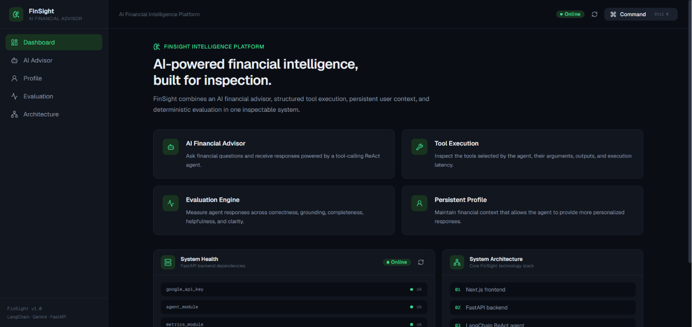
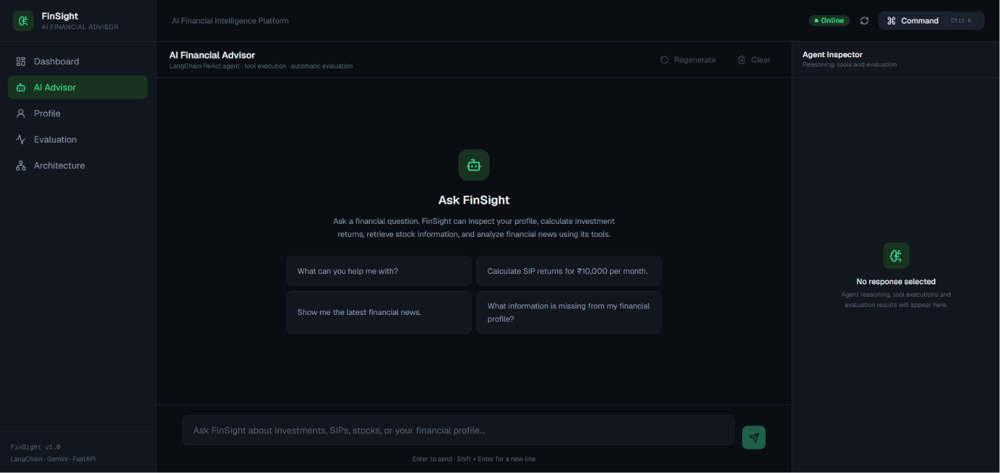
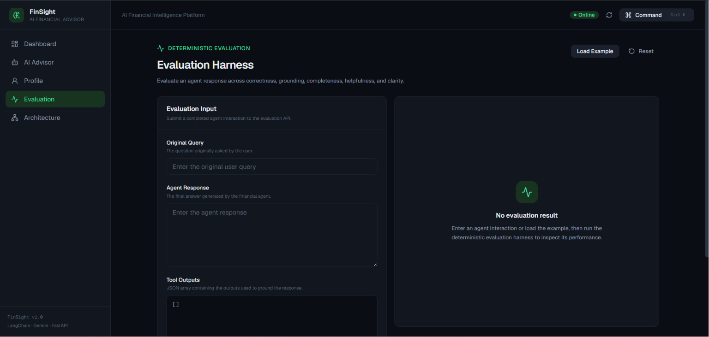
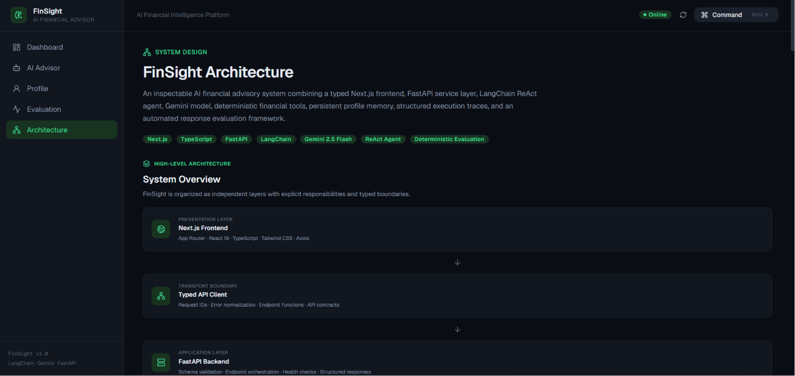

\# FinSight — AI Financial Advisor


FinSight is a full-stack AI-powered financial advisory application that combines conversational AI, financial calculation tools, persistent user profiles, and deterministic response evaluation.


The application uses a Gemini-powered LangChain agent to understand financial queries, select appropriate tools, perform calculations, retrieve financial information, and generate grounded responses through an interactive web interface.

## Demo

### Dashboard



### AI Chat



### Evaluation Framework



### Architecture



\## Features


\- Conversational AI financial assistant powered by Gemini

\- Tool-based agent architecture using LangChain

\- Persistent financial profile memory

\- Stock information retrieval

\- SIP return and CAGR calculators

\- Financial news retrieval and sentiment analysis

\- Tool execution and reasoning timeline visualization

\- Profile management through the web interface

\- Deterministic response evaluation across multiple quality dimensions

\- Backend health monitoring

\- Automated backend test suite with 61 passing tests

\- Production deployment with continuous deployment workflow


\## Architecture


FinSight follows a full-stack architecture:


## Architecture

```text
┌─────────────────────┐
│   Next.js Frontend  │
└──────────┬──────────┘
           │ REST API
           ▼
┌─────────────────────┐
│   FastAPI Backend   │
└──────────┬──────────┘
           │
           ▼
┌─────────────────────┐
│ LangChain ReAct     │
│ Agent               │
└──────────┬──────────┘
           │
           ├── Gemini 2.5 Flash
           │
           ├── Financial Tools
           │   ├── Stock Information
           │   ├── SIP Calculator
           │   ├── CAGR Calculator
           │   ├── Financial News
           │   └── Profile Management
           │
           ├── Persistent Profile Memory
           │
           └── Deterministic Evaluation Framework
```